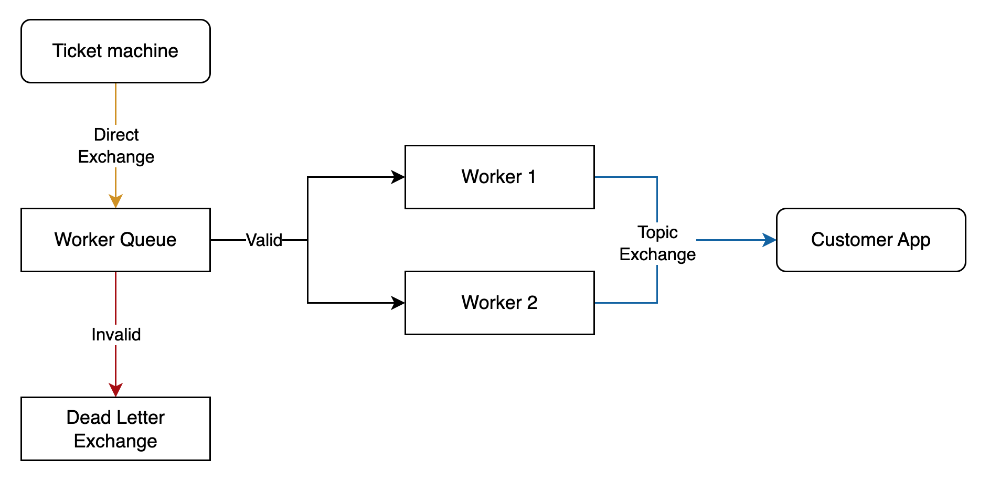

# Amusement park ticketing application

## Overall:
Ticket Machine (in `ticket_machine.py`) receives information when customers tap their phone to the machine. 

In Ticket Worker (backend, in `worker.py`), the messages generated by the ticket machine are processed to check if a customer exists in the database and to check the price of the ride. 

The relevant customer then will be notified about the amount they must pay on their Customer App.

## Repository structure:
```angular2html
└── ticket_app
    ├── __init__.py
    ├── requirements.txt 
    ├── customer_app.py
    ├── db_and_event_definitions.py
    ├── ticket_machine.py
    ├── worker.py
    ├── xprint.py
```

## Workflow:
The diagram below shows an overview of the exchanges and messaging queues to be implemented.




## Tools:
- RabbitMQ: an open source message broker that support asynchronous messaging and message queuing.
- Pika: a RabbitMQ client library for Python.

## How to run:
Start a worker:
```
python3 run_worker.py --id "<worker-id>"
```

Start a customer app:
```
python3 run_customer_app.py -c "<customer-id>"
```
Generate a TicketEvent with 
```
python3 produce_ticket_event.py -c "<customer-id>" -r "<ride_number>"
```

With these scripts you can check whether the messages are received as expected. 